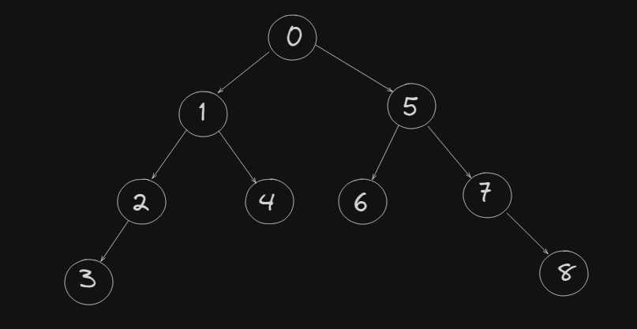

# Depth First Traversal

Depth First Traversal is a traversal technique that is used to traverse through a tree or graph data structure. It starts at the root node and explores as far as possible along each branch before backtracking.

The depth-first traversal is often implemented recursively. The recursive approach is based on the idea of using a stack data structure to keep track of the nodes to be visited. The stack is used to keep track of the nodes that have not yet been visited. 

The algorithm works as follows:

1. Start at the root node.
2. Mark the current node as visited.
3. Push the current node onto the stack.
4. Traverse the current node's left child (if it exists).
5. Traverse the current node's right child (if it exists).
6. Pop the top node from the stack.
7. Repeat steps 3-6 until the stack is empty.
8. The algorithm visits each node exactly once.

## Pseudocode
```java
function depthFirstTraversal(node)
    if node is null:
        return
    visit(node)
    stack.push(node)
    depthFirstTraversal(node.left)
    depthFirstTraversal(node.right)
    stack.pop()
```

## Advantages

- Depth-first traversal is often used to traverse through a tree or graph data structure.
- It is a recursive algorithm, which makes it easy to understand and implement.
- It is a good choice for applications that require a specific order of traversal.

## Disadvantages

- Depth-first traversal can be inefficient for large trees or graphs, as it may require multiple traversals to reach a leaf node.
- It may not be the most efficient choice for applications that require a specific order of traversal.

## Applications

- Depth-first traversal is commonly used in computer science to traverse through a tree or graph data structure.
- It is often used in applications that require a specific order of traversal, such as in a search algorithm.
- It is also used in applications that require a specific order of traversal, such as in a sorting algorithm.
- It is commonly used in applications that require a specific order of traversal, such as in a breadth-first search algorithm.

## types of Depth First Traversal
1. Inorder Traversal
2. Preorder Traversal
3. Postorder Traversal
4. Reverse Inorder Traversal
5. Reverse Preorder Traversal
6.  Reverse Postorder Traversal
7.  Reverse Depth First Traversal

## Inorder Traversal

Inorder traversal is a method of traversing a tree in which the left subtree is visited first, then the root node, and then the right subtree.
```rust
inorder(root->left)
display(root->data)
inorder(root->right)
```

## Preorder traversal
- Visit root node
- Visit all the nodes in the left subtree
- Visit all the nodes in the right subtree
```rust
display(root->data)
preorder(root->left)
preorder(root->right)
```

## Postorder traversal
- Visit all the nodes in the left subtree
- Visit all the nodes in the right subtree
- Visit the root node
```rust
postorder(root->left)
postorder(root->right)
display(root->data)
```

## level order traversal

- Level order traversal is `breadth first traversal` for binary trees.
- Level order traversal of a binary tree is to first visit the left subtree and then the right subtree.
- Level order traversal of a binary tree is done level by level starting from the root.

### Algorithm

1.  Create an empty queue and enqueue the root.
2.  Create a loop while queue is not empty.
3.  Dequeue the node and print it.
4.  Enqueue the left child of the dequeued node.
5.  Enqueue the right child of the dequeued node.
6.  Repeat steps 3 to 5 until queue is empty.
7.  End.

### Code

```java
class Solution {
    public void levelOrder(TreeNode root) {
        Queue<TreeNode> q = new LinkedList<>();
        q.add(root);
        while (!q.isEmpty()) {
            TreeNode node = q.poll();
            System.out.print(node.val + " ");
            if (node.left != null)
                q.add(node.left);
            if (node.right != null)
                q.add(node.right);
        }
    }
}
```

## Other Tree Traversals:
- Boundary Traversal
- Diagonal Traversal


